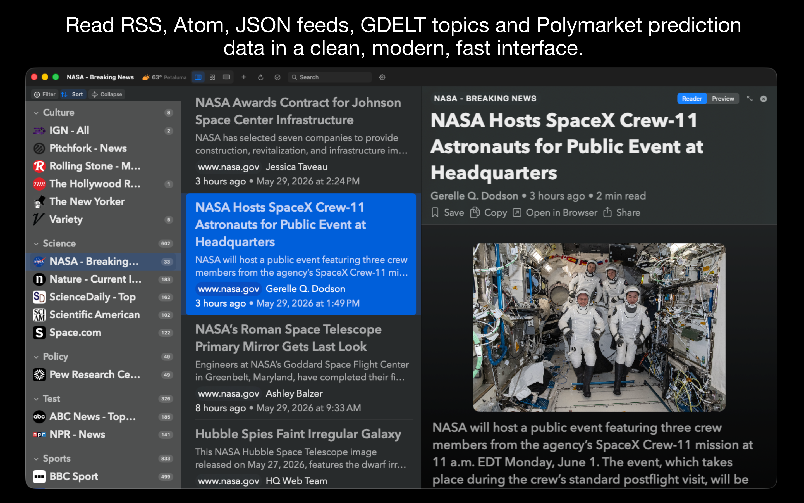

# News App: RSS Reader & More

A native macOS news reader built with SwiftUI. Supports RSS, Atom, and JSON Feed formats, plus live global event data from GDELT and public prediction-market data from Polymarket.




## Features

- **Multi-format feeds** -- RSS 2.0, Atom 1.0, JSON Feed
- **Smart feed discovery** -- paste any URL and the app finds its feeds automatically (30+ fallback patterns)
- **OPML import/export** -- bring your feeds from other readers, or back them up
- **Built-in reader mode** -- clean article view with configurable fonts, spacing, and width
- **GDELT integration** -- browse global news events by topic (politics, tech, science, climate, etc.) in 13 languages
- **Polymarket integration** -- view public probability, volume, and price-history data
- **Masonry/newspaper layout** -- a card-based grid view inspired by print newspapers
- **TV View** -- a broadcast-style presentation with Ken Burns image animations and lower-third graphics
- **Radio** -- stream news/talk radio stations from a built-in directory
- **Content blocking** -- built-in ad blocker for the web view
- **Keyboard navigation** -- arrow keys to move between sidebar, article list, and reader panes
- **Dark mode** -- follows system appearance or set manually
- **Custom lists** -- organize articles into bookmarks and custom collections
- **Auto-refresh** -- configurable background refresh interval
- **Local storage** -- all data stays on your Mac in `~/Library/Application Support/NewsApp/`

## Install

### Download the app

For customers, install **News App: RSS Reader & More** from the Mac App Store when available.

### Build from source

Requires **macOS 14+** and **Xcode 26+** for App Store submission builds.

```bash
git clone https://github.com/hudleyholdings/NewsApp.git
cd NewsApp
./scripts/make_app_bundle.sh
open build/NewsApp.app
```

The build script compiles a release build, generates the app icon, bundles resources, adds App Sandbox entitlements, and code-signs the app. By default it uses ad-hoc signing for local development; set `CODE_SIGN_IDENTITY`, `APP_VERSION`, `BUILD_NUMBER`, and `BUNDLE_IDENTIFIER` for distribution builds.

To build a debug version:

```bash
./scripts/make_app_bundle.sh debug
```

Or if you just want to compile without bundling:

```bash
swift build
```

## Project Structure

```
Sources/NewsApp/
  NewsAppApp.swift          # App entry point
  Models/                   # Data models (Article, Feed, RadioStation, etc.)
  Services/                 # Feed parsing, discovery, GDELT/Polymarket APIs, radio
  Stores/                   # State management and persistence
  Views/                    # SwiftUI views
    Components/             # Reusable UI components
    TVView/                 # Broadcast-style TV presentation
  Resources/                # Bundled data (seed feeds, radio stations, content blocker)
```

## Dependencies

- [SwiftSoup](https://github.com/scinfu/SwiftSoup) -- HTML parsing for feed discovery and content extraction

That's it. Everything else uses Apple frameworks (SwiftUI, AVFoundation, WebKit, CoreLocation).

## Data Sources

- **RSS/Atom/JSON Feed** -- any standard web feed
- **GDELT Project** -- free, open global event database (no API key required)
- **Polymarket** -- public prediction market data via their CLOB API (no API key required)

## License

MIT License. See [LICENSE](LICENSE) for details.
